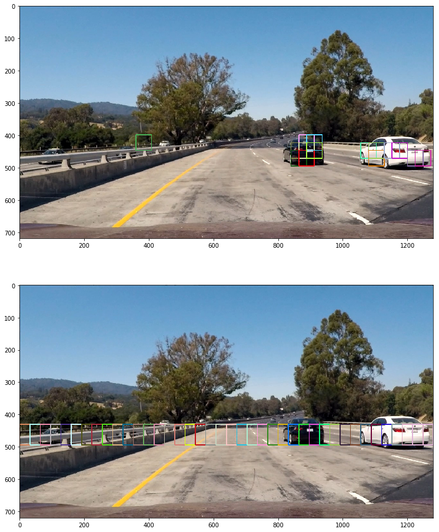

**Vehicle Detection Project**

The goals / steps of this project are the following:

* Perform a Histogram of Oriented Gradients (HOG) feature extraction on a labeled training set of images and train a classifier Linear SVM classifier
* Optionally, you can also apply a color transform and append binned color features, as well as histograms of color, to your HOG feature vector. 
* Note: for those first two steps don't forget to normalize your features and randomize a selection for training and testing.
* Implement a sliding-window technique and use your trained classifier to search for vehicles in images.
* Run your pipeline on a video stream (start with the test_video.mp4 and later implement on full project_video.mp4) and create a heat map of recurring detections frame by frame to reject outliers and follow detected vehicles.
* Estimate a bounding box for vehicles detected.

## [Rubric](https://review.udacity.com/#!/rubrics/513/view) Points
### Here I will consider the rubric points individually and describe how I addressed each point in my implementation.  

---
### Writeup / README

#### 1. Provide a Writeup / README that includes all the rubric points and how you addressed each one.  You can submit your writeup as markdown or pdf.  [Here](https://github.com/udacity/CarND-Vehicle-Detection/blob/master/writeup_template.md) is a template writeup for this project you can use as a guide and a starting point.  

You're reading it!

### Histogram of Oriented Gradients (HOG)

#### 1. Explain how (and identify where in your code) you extracted HOG features from the training images.

I used the code provided in the course material for HOG and histogram extraction. Here's an example image showing a car and not a car in HOG features.

#### 2. Explain how you settled on your final choice of HOG parameters.

I used trial and error to find the best hog parameters. I used many variations to see what the output image looked like as well as the model's accuracy. While waiting for the pipeline to complete I discovered GridSearchCV. I think I'd like to try that in the future.

#### 3. Describe how you trained a classifier using your selected HOG features (and color features if you used them).

I trained a linear SVM using HOG, color history and spatial bin features.

### Sliding Window Search

#### 1. Describe how you implemented a sliding window search.  How did you decide what scales to search and how much to overlap windows?

I used the hints provided in the course material, along with random trial and error to see where the searching would be done.

#### 2. Show some examples of test images to demonstrate how your pipeline is working.  What did you do to optimize the performance of your classifier?

I used the sliding window search in my pipeline for the initial run to find cars.

It was a little slow, so then I used the find_cars function provided in the course material.
I also used many scales to find matches.

I used many scales because I noticed my pipeline had a harder time detecting cars in the distance. To accomodate, I expanded the area of search and provided a smaller scale which seemed to help.

The image below is an example of using find_cars, with the second image being where the pipeline is searching.

---

### Video Implementation

#### 1. Provide a link to your final video output.  Your pipeline should perform reasonably well on the entire project video (somewhat wobbly or unstable bounding boxes are ok as long as you are identifying the vehicles most of the time with minimal false positives.)
Here's a [link to my video result](./project_video_output.mp4)

#### 2. Describe how (and identify where in your code) you implemented some kind of filter for false positives and some method for combining overlapping bounding boxes.

I recorded the positions of positive detections in each frame of the video.  From the positive detections I created a heatmap and then thresholded that map to identify vehicle positions.  I then used `scipy.ndimage.measurements.label()` to identify individual blobs in the heatmap.  I then assumed each blob corresponded to a vehicle.  I constructed bounding boxes to cover the area of each blob detected.

I also used the last five frames worth of images to keep the matches from jumping around frame to frame.

---

### Discussion

#### 1. Briefly discuss any problems / issues you faced in your implementation of this project.  Where will your pipeline likely fail?  What could you do to make it more robust?

The biggest challenge for me is getting window sizes right and narrowing the field of vision. The video shows cars detected on the other side of the lane (which is somewhat impressive). I thought about restricting the search along the X-axis, but that would only fix the problem for this assignment and would not be correct if, for example, the car was recording from the right-most lane instead of the left lane.

I also noticed the car is lost for a few seconds on the color change of the bridge. I spent some time extracting frames from this part of the video and trying to come up with a solution. I was able to recognize cars in stand-alone images but it still failed during the run of the pipeline. If I had more time I would like to explore that more.

I'd like to fix these problems but find myself short on personal time to devote to it with the holiday rush coming up.

 - In the future I'd like to experiment with using GridSearchCV, which will find the best hyperparameters for me.
  - I'd like to try this with the YOLO tracking algorithm instead of the old way of detecing vehicles. This seems to perform better based off the videos I've seen.

  Overall it was a good project for learning how detection may have been done before neural nets took over. I did find it a little odd to spend a good amount of time on machine learning, only to abandon it for this project.